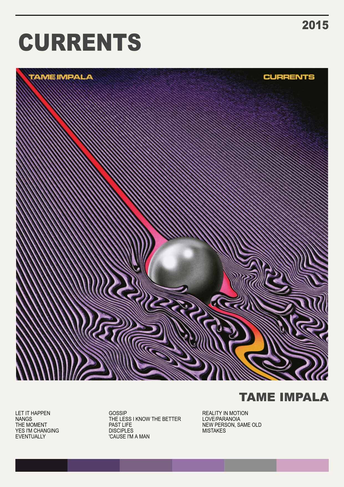
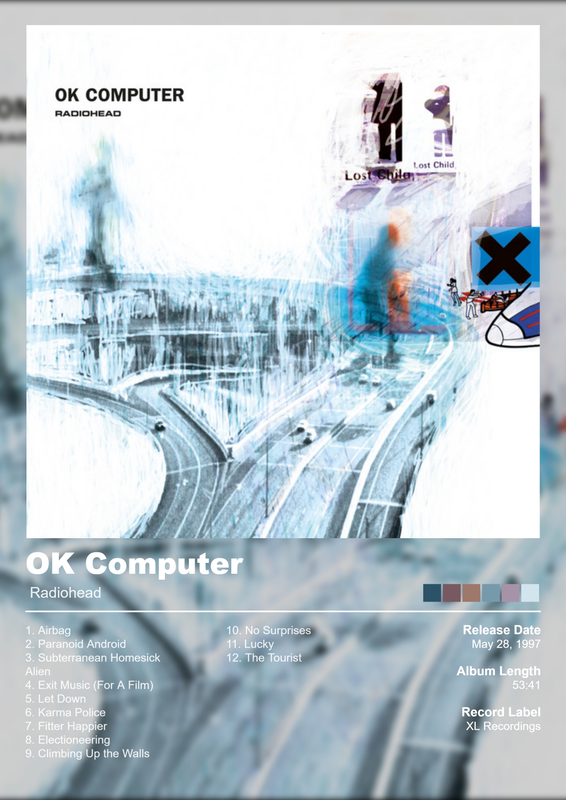

# 🎵 Album Poster Maker

Album Poster Maker is a web application that generates **high-quality poster PDFs** for music albums using data from **Spotify's Web API**.  
It allows the user to search for an album, preview it in two different poster templates, and export the result as a PDF in multiple paper sizes (A0–A6).

---

## 🎨 Examples

Here are some posters generated by this project:

---

## 📌 Features
- Search albums via Spotify API.  
- Real-time search suggestions while typing.  
- Two unique poster templates:
  - **Template 1**: Clean, minimalist, text-focused design, white background.  
  - **Template 2**: Full-size cover, blur background, metadata, and tracklist.  
- Automatic font resizing to fit titles and tracklists.  
- Export posters in **PDF format** (A0–A6, portrait).  
- Extracted color palette from the album cover to enrich the design.  

---

## 🛠️ Technologies Used

### Backend
- **Python 3** with **Flask** (API + server-side rendering).
- **Requests** (for Spotify API calls).
- **dotenv** (environment variable management).

### Frontend
- **HTML5** (with Jinja2 templating).  
- **CSS3** (clean and responsive, separated from HTML).  
- **JavaScript (ES6 Modules)** for:
  - DOM manipulation  
  - Canvas rendering  
  - Poster drawing logic  
  - Event handling  

### Canvas Rendering & PDF
- **HTML5 Canvas API** (poster drawing).  
- **jsPDF** (PDF export).  
- **Color Thief** (extract dominant colors from album covers).

---

## 📖 Documentation & Code Style
This project follows **formal documentation standards**:
- **JavaScript**: JSDoc-style comments for functions and parameters.  
- **Python**: PEP-8 compliant with docstrings explaining each function.  
- **HTML/CSS/JS** are well-commented to explain structure and logic.  

This ensures maintainability and clarity for developers exploring the project.

---

## ⚡ Installation & Usage

### 1. Clone the Repository
bash
git clone https://github.com/YOUR-USERNAME/album-poster-maker.git
cd album-poster-maker

### 2. Setup Environment

Create a virtual environment (recommended):
bash
python -m venv venv
source venv/bin/activate   # Linux/Mac
venv\Scripts\activate      # Windows

Install dependencies:
bash
pip install -r requirements.txt

### 3. Configure Spotify API Credentials

Create a .env file in the project root with:

SPOTIFY_CLIENT_ID=your_client_id_here
SPOTIFY_CLIENT_SECRET=your_client_secret_here

**You can get your Spotify Credentials by creating an app on https://developer.spotify.com/dashboard**

### 4. Run the Application

bash
python app.py

**By default, Flask will start at:**

http://127.0.0.1:5000/

### 5. Using the Application
- Enter the album name in the search box.  
- Select the template and paper format.  
- Preview the poster.  
- Export as **PDF** with one click.  

---

## ⚠️ Disclaimer
All album art, data, and information belongs to Spotify and the respective artists, and this project is for educational purposes only.
